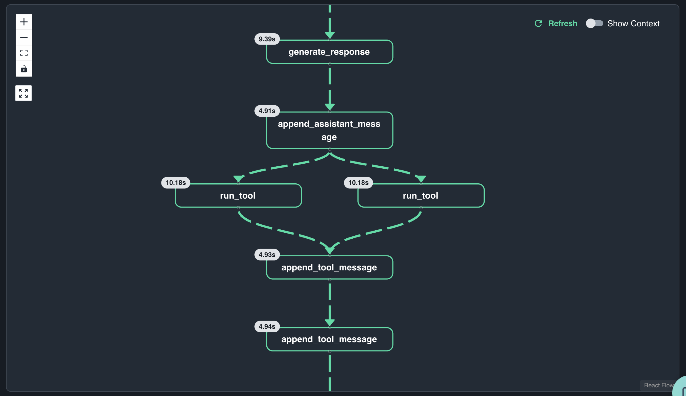

# Durable Agent Hello World

This is the simplest example of a durable agent and serves as the perfect starting point for understanding Dapr Agents. Running this example demonstrates the core concepts of durable agents: tool execution, state persistence, and workflow orchestration.

## Prerequisites

Make sure you have completed the setup from the [main README](../README.md):

## What This Example Demonstrates

- **Basic Durable Agent**: Simple agent setup with essential configuration
- **State Persistence**: Agent state and memory persisted in Catalyst
- **Workflow Orchestration**: Automatic workflow creation and management
- **Parallel Tool Execution**: Agent makes two tool calls in parallel (London and Paris)
- 
### Architecture

The hello world example demonstrates a simple but powerful workflow pattern where a single agent request triggers parallel tool execution:

```
Agent Start → Parallel Tool Calls → search_flights(London) + search_flights(Paris) → Combined Results
```

**Workflow Overview:**
When you run this example, Dapr automatically creates and manages a durable workflow. The agent processes your request and intelligently determines that it needs to search for flights to two destinations. Instead of making sequential calls, it executes both tool calls in parallel for optimal performance.



The workflow visualization in Catalyst shows:
- **Initial agent processing** of the multi-destination request
- **Parallel tool execution** for London and Paris flight searches
- **State persistence** at each step for durability
- **Result aggregation** combining both flight options into a single response

## Deploy and Run

Deploy the hello world agent to Catalyst:

```bash
diagrid dev run -f dapr.yaml --approve
```

The agent will automatically:
1. Initialize with the travel planning role
2. Process the request: "Find me flights to London and Paris?"
3. Execute two parallel tool calls to `search_flights`
4. Each tool call simulates a 10-second external API call
5. Return combined flight options for both destinations
6. Persist all execution state and conversation history in Catalyst

## Monitor Execution in Catalyst

### Workflow Execution
- Navigate to Catalyst dashboard → Workflows
- View the automatically created workflow for the agent execution
- Observe the parallel tool execution pattern
- Monitor the 10-second execution time for each tool call

### State Management
- **Execution State**: Components → Key-Value Store → `execution-state`
- **Memory State**: Components → Key-Value Store → `memory-state`
- **Agent Registry**: Components → Key-Value Store → `registry-state`

## Expected Output

The agent will return flight options for both London and Paris:

```
Travel Planner Agent response: I found flight options for both destinations:

London:
- SkyHighAir: $450.00
- GlobalWings: $375.50

Paris:
- SkyHighAir: $450.00  
- GlobalWings: $375.50
```

## Next Steps

Once you've successfully run this hello world example:

Ready to explore headless agents? Check out the [02_durable-agent-headless](../02_durable-agent-headless/README.md) example to learn about REST API and PubSub triggering.