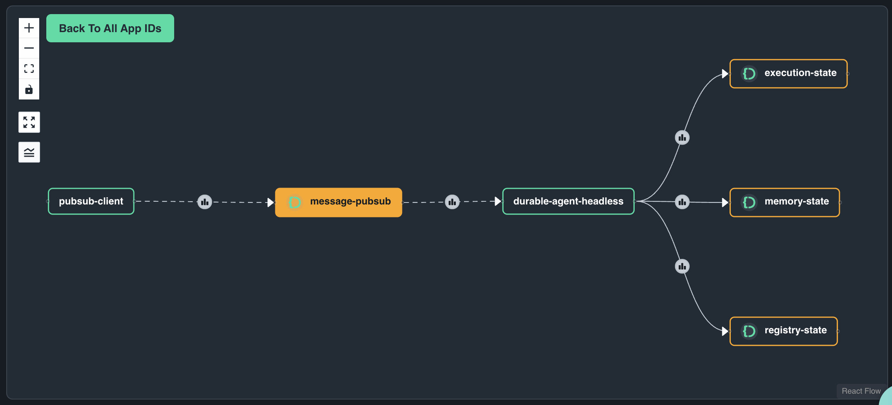

# Durable Agent Headless

This sample demonstrates how to run a durable headless agent that can be triggered over HTTP REST API and PubSub messaging. Unlike the chat example, this agent runs without a UI and is perfect for backend integrations and automated workflows.

## Prerequisites

Make sure you have completed the setup from the [main README](../README.md):

## What This Example Demonstrates

- **Headless Operation**: Agent runs as a service without UI
- **Dual Triggering**: Support for both REST API and PubSub messaging
- **Durable Execution**: Workflow state persisted across restarts
- **Tool Integration**: Flight search with mock external API calls (50% chance of 20-second delay)
- **State Management**: Conversation memory, execution state, and agent registry

## Trigger Workflows via REST API

### 1. Deploy and Run the Agent

Deploy the headless agent to Catalyst with managed infrastructure:

```bash
diagrid dev run -f dapr.yaml --approve
```

This starts:
- REST endpoint on port 8001
- PubSub consumer for message-based triggers
- Durable workflow engine with state persistence

### 2. Trigger a Workflow

From another terminal, trigger a workflow via REST API:

```bash
curl -i -X POST http://localhost:8001/start-workflow \
  -H "Content-Type: application/json" \
  -d '{"task": "I want to find flights to London"}'
```

The agent will:
1. Process your flight request
2. Execute the `search_flights` tool (50% chance of 20-second delay)
3. Return flight options with pricing
4. Persist all state in Catalyst's managed key-value store

### 3. Monitor Execution in Catalyst

**Check Workflow Execution:**
- Navigate to Catalyst dashboard → Workflows
- View real-time execution progress and detailed logs
- Inspect individual workflow steps and timing

**Examine State Storage:**
- Go to Components → Key-Value Store → `statestore` (execution state)
- See how workflow state is persisted
- View conversation memory in `memory-state`
- Check agent registry in `registry-state`

## Option 2: Trigger Workflows via PubSub

### 1. Deploy Agent with PubSub Client

Run the agent with an additional PubSub client that sends multiple messages:

```bash
diagrid dev run -f dapr-pubsub-client.yaml --approve
```

This configuration:
- Runs the headless agent (same as above)
- Includes a PubSub client (`app_pubsub_client.py`)
- Automatically sends flight requests to Paris, London, Tokyo, and New York
- Each request triggers a separate workflow instance

### 2. Observe Parallel Processing

The PubSub client will automatically trigger multiple workflows:
- Each destination gets processed as a separate workflow
- Agent handles multiple concurrent requests
- All executions are tracked independently in Catalyst

### 3. Explore Application Architecture

**View Service Communication:**
- In Catalyst dashboard → Application Map
- See the interaction between PubSub client and agent
- Observe message flow and service dependencies



**Monitor PubSub Messaging:**
- Components → Pub/Sub → `message-pubsub`
- Track message delivery and processing
- View throughput and error rates

## Next Steps

- Explore the [03_durable-agent-chat](../03_durable-agent-chat/README.md) for interactive UI
- Check out the [04_agent-orchestration](../04_agent-orchestration/README.md) for multi-agent coordination

