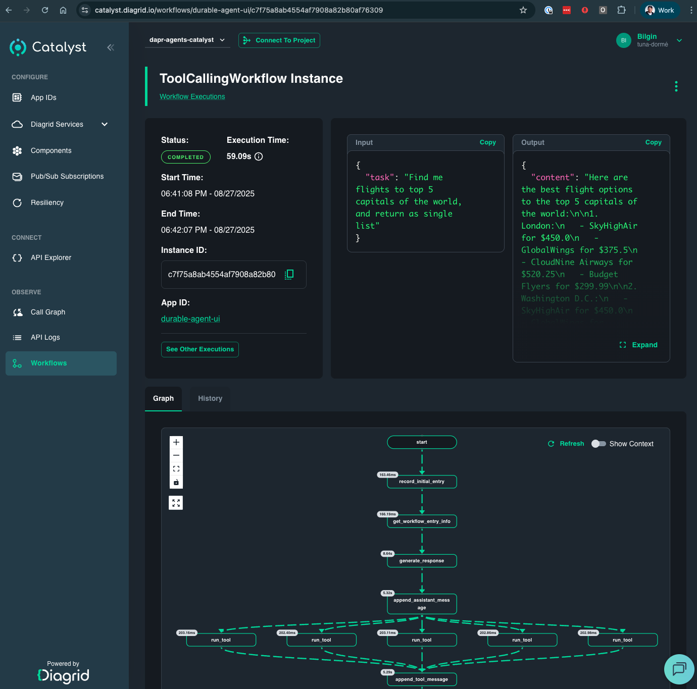
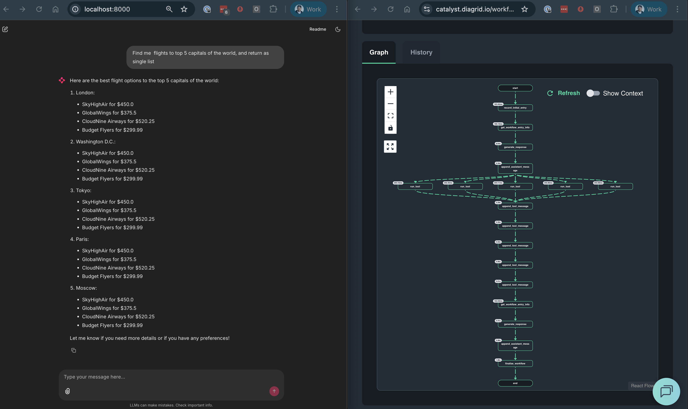

# Durable Agent Chat

This example demonstrates how to build an interactive chat interface for durable agents using Chainlit. Unlike the headless examples, this provides a user-friendly web UI where you can have conversations with your agent and see real-time responses.

## Prerequisites

Make sure you have completed the setup from the [main README](../README.md):

## What This Example Demonstrates

- **Interactive Chat UI**: Web-based chat interface using Chainlit for live conversation with durable agents
- **Session Management**: Each chat session gets a unique ID for isolated conversations
- **Persistent Memory**: Agent remembers conversation history across messages using Dapr state store
- **Tool Integration**: Flight search tool accessible through natural conversation
- **Durable Execution**: Each chat message creates a workflow with state persistence

### Architecture

```
User Chat → Chainlit UI → DurableAgent → Tool Calls → Persistent State → Response
```

The chat interface creates a new agent session for each user, enabling multiple concurrent conversations with isolated state. Each message creates a durable workflow that persists execution state.

## Deploy and Run

Deploy the chat agent to Catalyst:

```bash
diagrid dev run -f dapr.yaml --approve
```

Once deployed, access your agent:

- **Chat Interface**: [http://localhost:8000/](http://localhost:8000/) - Interactive Chainlit web interface
- **Catalyst Dashboard**: [https://catalyst.diagrid.io/](https://catalyst.diagrid.io/) - Monitor workflows and agent execution

## Using the Chat Interface

### Starting a Conversation

Open the Chainlit web interface and start with a simple flight request:

**Example: "Find me flights to London"**


This shows how the agent processes your request and provides flight options through the interactive chat interface.

### Multi-Destination Queries

Try a more complex request that triggers multiple tool calls:

**Example: "Find me flights to top 5 capitals of the world"**



This demonstrates how the agent intelligently breaks down complex requests and executes multiple tool calls for different destinations.

### Complete Workflow Visualization
Each chat message creates a new workflow execution:
- Navigate to Catalyst dashboard → Workflows
- Each conversation message appears as a separate workflow
- View detailed execution for individual chat interactions

See the full journey from chat interaction to workflow execution:



This side-by-side view shows both the chat interface with comprehensive flight results and the corresponding workflow execution in Catalyst, demonstrating how each chat message creates detailed workflow traces.

## Next Steps

- Check out the [04_agent-orchestration](../04_agent-orchestration/README.md) for advanced workflow patterns and orchestration
- Explore the [05_customer-support-system](../05_customer-support-system/README.md) for a complete multi-agent system
