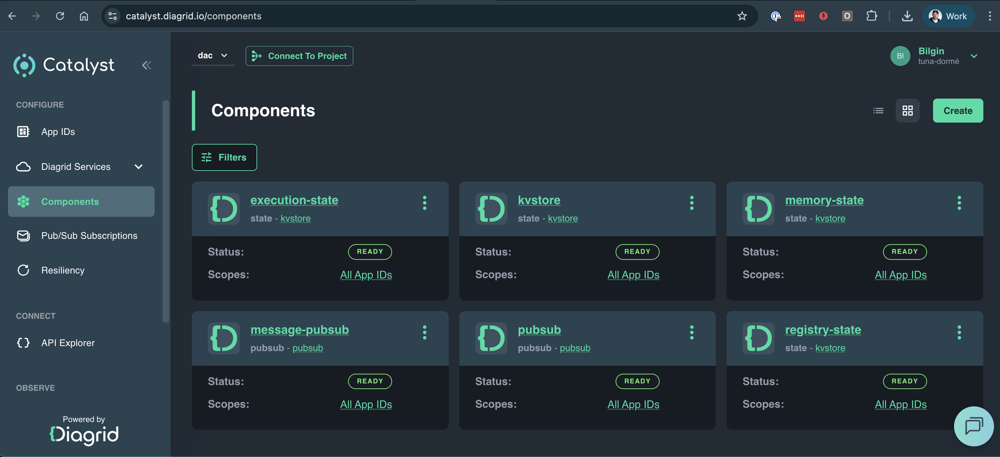

# Dapr Agents Examples with Diagrid Catalyst

These samples demonstrate how to build and deploy durable agentic workloads using [Dapr Agents](https://github.com/dapr/dapr-agents), and run them with [Diagrid Catalyst](https://www.diagrid.io/catalyst).

## Prerequisites

### Set up your local environment:

```bash
# Create a virtual environment
python3.10 -m venv .venv

# Activate the virtual environment 
source .venv/bin/activate  # On macOS/Linux
# .venv\Scripts\activate   # On Windows

# Install dependencies
pip install -r requirements.txt
```

### Set your OpenAI API key:
```bash
export OPENAI_API_KEY=your_api_key_here
```

### Sign up for Catalyst and Download CLI

Sign up for Diagrid Catalyst and install the CLI: https://docs.diagrid.io/catalyst/getting-started/first-api-call

Now login to Catalyst and create a project with all the infrastructure your agent needs - workflows for orchestration, pub/sub for messaging, and key-value storage for state:

### Create a Project with Agentic Infrastructure

```bash
diagrid login
diagrid product use catalyst
diagrid project create dapr-agents-catalyst-samples --deploy-managed-pubsub --deploy-managed-kv --enable-managed-workflow
```

This provisions a complete managed Dapr environment in the cloud. The project overview shows your managed infrastructure components being deployed:




## Examples

Each example demonstrates different patterns and capabilities of Dapr Agents with Catalyst. Navigate to each folder and follow the specific instructions in their README files.

| Example | Description                                                                                                                                    |
|---------|------------------------------------------------------------------------------------------------------------------------------------------------|
| [01_durable-agent-hello-world](./01_durable-agent-hello-world/) | **Start here!** Simplest durable agent example demonstrating parallel tool execution and state persistence                                     |
| [02_durable-agent-headless](./02_durable-agent-headless/) | Headless agent triggered via REST API that demonstrates workflow orchestration for backend integrations                                        |
| [03_durable-agent-chat](./03_durable-agent-chat/) | Interactive chat agent with Chainlit UI that maintains conversation state and full workflow observability                                      |
| [04_agent-orchestration](./04_agent-orchestration/) | Deterministic workflow orchestration including sequential task chains and parallel execution (fan-out/fan-in)|

## Next Steps


- Try the [01_durable-agent-hello-world](./01_durable-agent-hello-world/README.md) for a quick intro.

## Contact Us

Do you have any questions? Reach out to us here: https://www.diagrid.io/contact-us

