# Hello World with Dapr Agents and Diagrid Catalyst

This quickstart demonstrates how to build and deploy a durable AI agent locally using [Dapr Agents](https://github.com/dapr/dapr-agents), then seamlessly deploy it to [Diagrid Catalyst](https://www.diagrid.io/catalyst).

## Prerequisites

Set up your local environment:

```bash
# Create a virtual environment
python3.10 -m venv .venv

# Activate the virtual environment 
source .venv/bin/activate  # On macOS/Linux
# .venv\Scripts\activate   # On Windows

# Install dependencies
pip install -r requirements.txt
```

Set your OpenAI API key:
```bash
export OPENAI_API_KEY=your_api_key_here
```

## 🚀 Start Local Development

Run the agent locally with Dapr - this starts your durable agent with local Redis state store and workflow engine:

```bash
dapr run -f dapr.yaml
```

Test your agent by asking about London. The image shows the Chainlit UI where you can interact with your agent - notice how it maintains conversation state and provides travel recommendations:

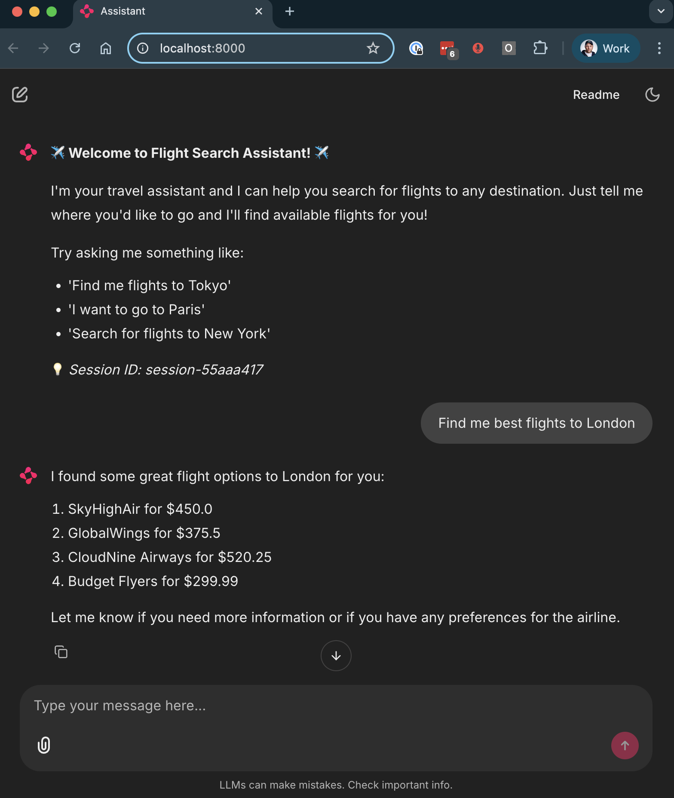


## 🔍 Monitor Local Infrastructure

Behind the scenes, your agent is persisting state and managing workflows. Check your local Dapr dashboard to see the running components - this shows your agent's health, state management, and workflow execution:

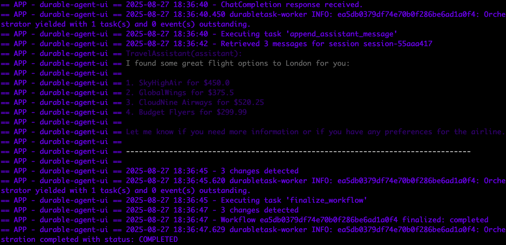

Inspect Redis state data to see how your agent's conversation state and workflow data is stored. This command launches RedisInsight to visualize your local data:

```bash
docker run --rm -d --name redisinsight -p 5540:5540 redis/redisinsight:latest
open http://localhost:5540/
```

Here you can see the actual state data stored by your durable agent - notice how it maintains session context and workflow state:

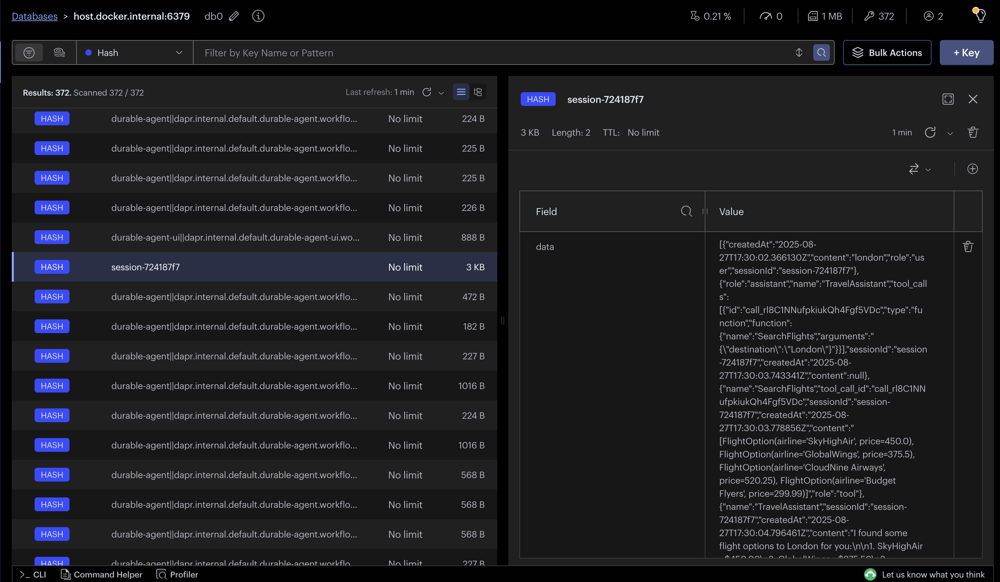

## ☁️ Deploy to Catalyst

### Setup Catalyst

First, sign up for Diagrid Catalyst and install the CLI: https://docs.diagrid.io/catalyst/getting-started/first-api-call

Now login to Catalyst and create a project with all the infrastructure your agent needs - workflows for orchestration, pub/sub for messaging, and key-value storage for state:

```bash
diagrid login
diagrid product use catalyst
diagrid project create dapr-agents-catalyst --deploy-managed-pubsub --deploy-managed-kv --enable-managed-workflow
```

This provisions a complete managed Dapr environment in the cloud. The project overview shows your managed infrastructure components being deployed:

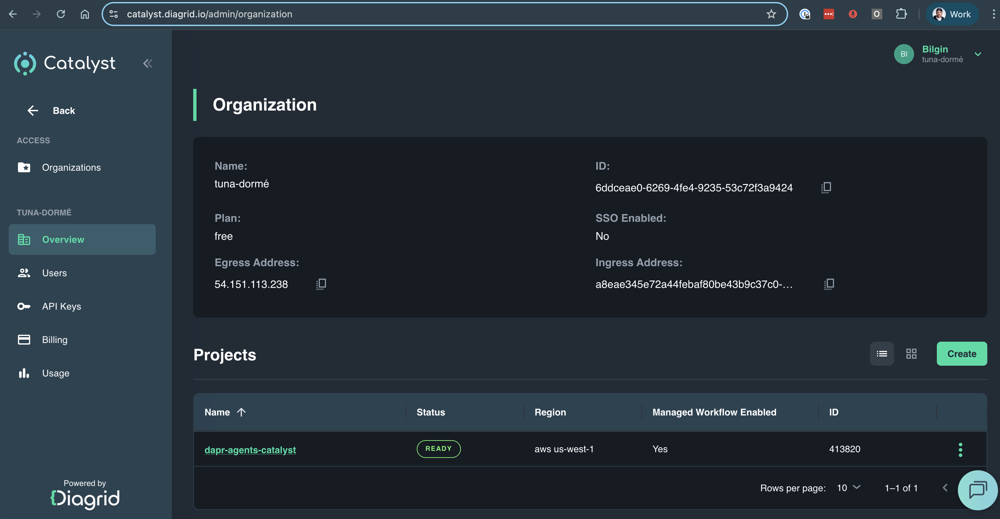

### Deploy Your Agent

Once infrastructure is provisioned and your project is in ready status, deploy your local app into the cloud. This command uploads your local Python agent and runs it against Catalyst's managed infrastructure:

```bash
diagrid dev run -f dapr.yaml --approve
```

The deployment shows your local Python app now running against Dapr and backing infrastructure provided by Catalyst - same code, cloud-scale infrastructure!

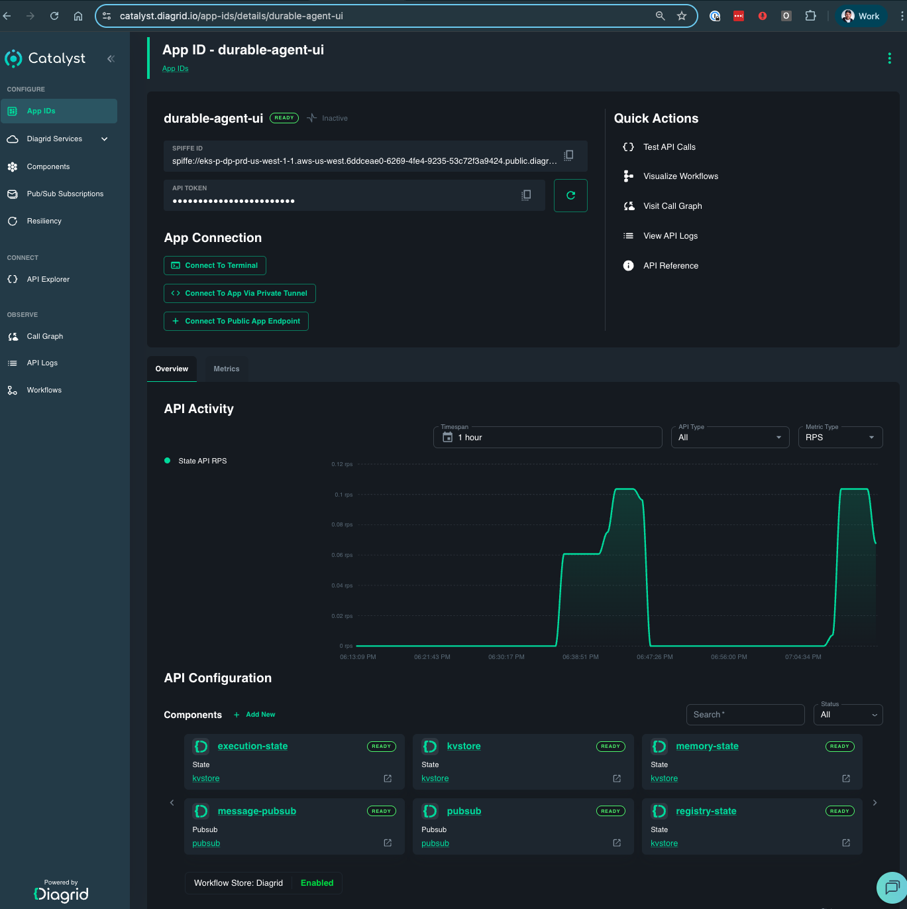


## 📊 Experience Catalyst Observability

Now that your agent is running in the cloud, explore Catalyst's enterprise-grade observability features:

### Workflow Monitoring
Explore all your workflow executions - each chat interaction results in a new workflow run. This view shows the complete history of your agent's conversations and decision-making processes:

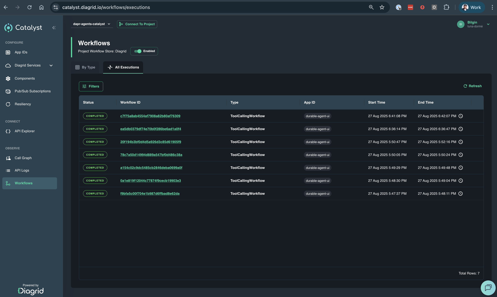

### Detailed Workflow Insights
Dive deep into individual workflow execution. This detailed view shows the complete execution graph, timing, and state transitions for a single conversation:

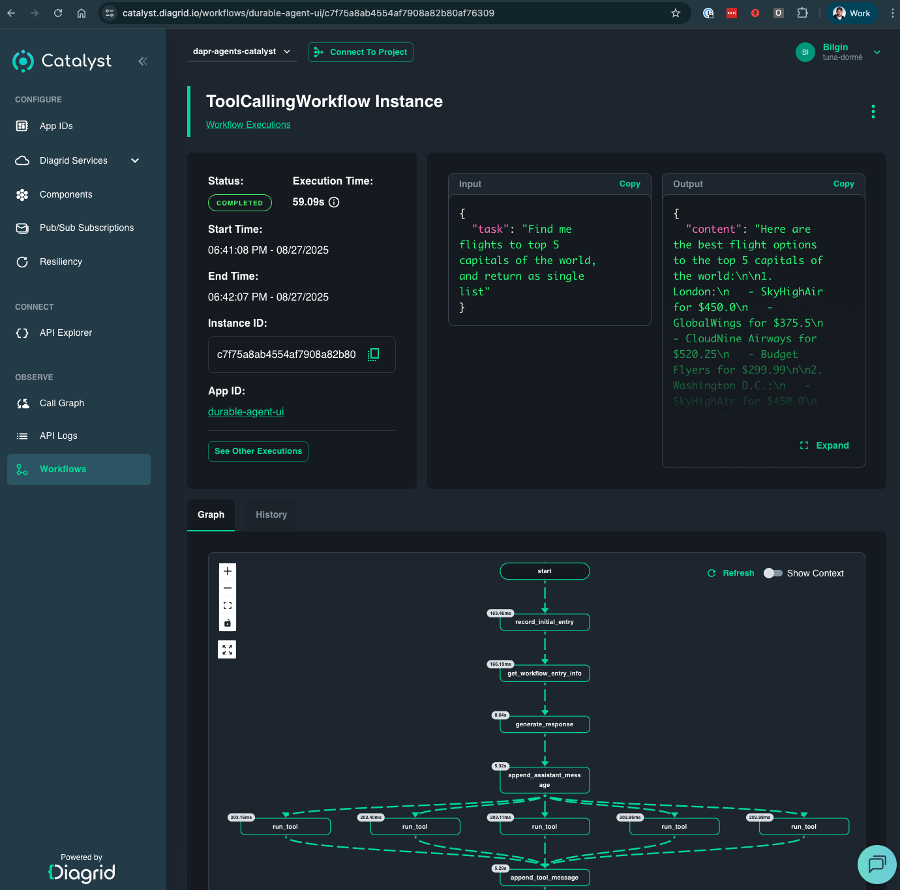

### Node-Level Exploration
Examine each step in your agent's decision process. Here you can see individual activities, their inputs, outputs, and execution details - perfect for debugging and understanding your agent's behavior:

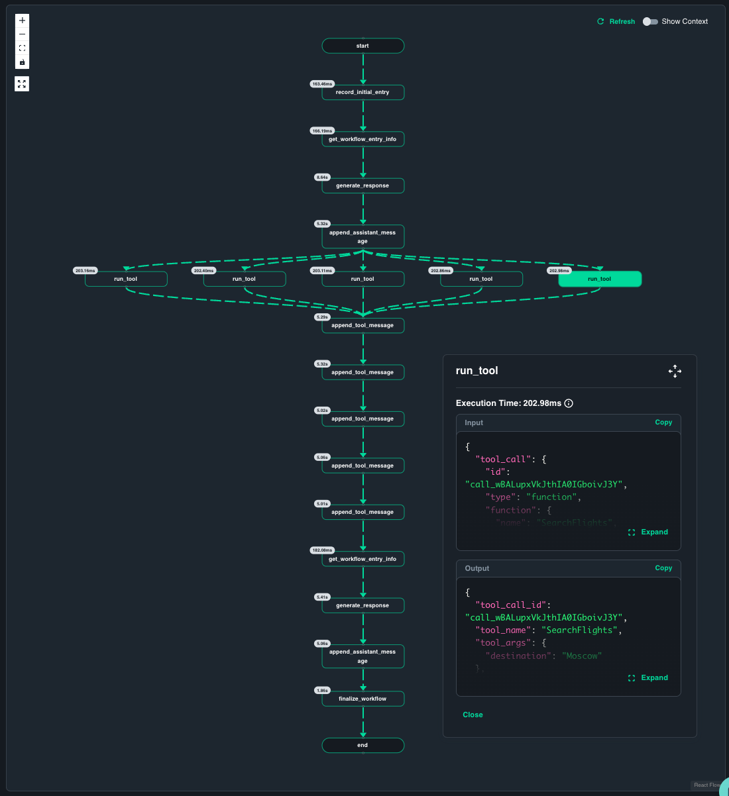

### Session Exploration
Track and manage your agent sessions from the components view. This shows how your agent maintains state across multiple interactions and tool calls:

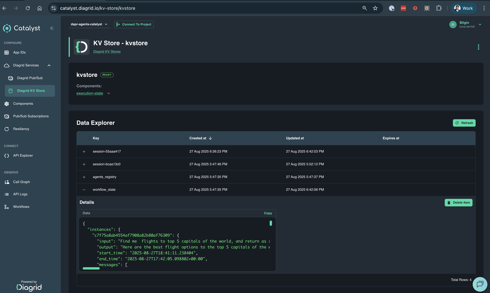

### The Complete Journey
Once all tool calls are completed, your agent returns comprehensive flight information to all 5 cities. 

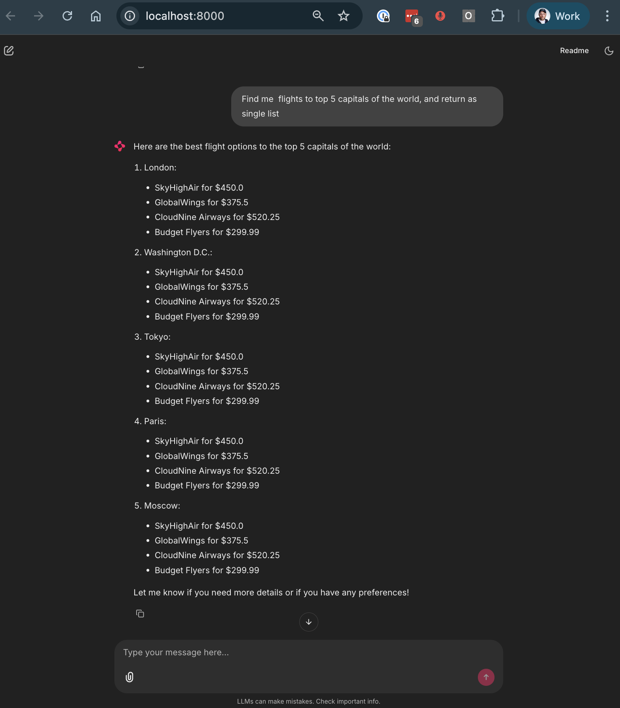

## 🎯 What You've Learned

- ✅ Built a durable AI agent locally with Dapr workflows and state management
- ✅ Deployed the same code to managed cloud infrastructure with zero changes
- ✅ Gained enterprise-grade observability with detailed workflow monitoring
- ✅ Scaled from prototype to production with Diagrid Catalyst

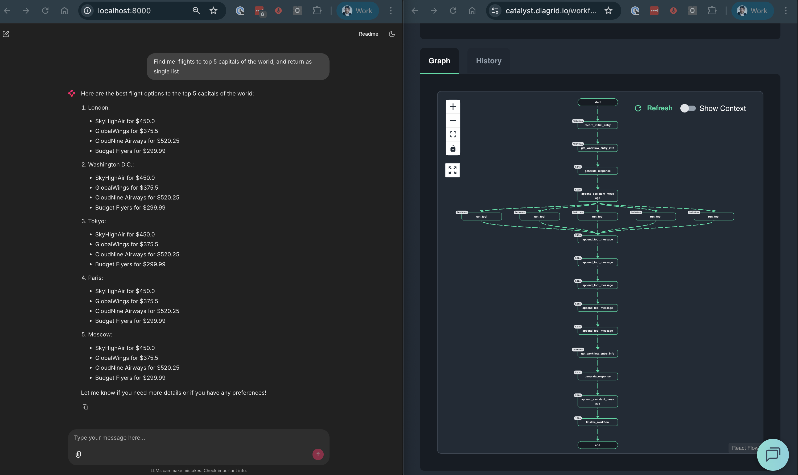

You've just experienced the power of building locally and deploying to the cloud with the same agent code! 

**Ready to build more advanced agents?** Talk to us: https://www.diagrid.io/contact-us


